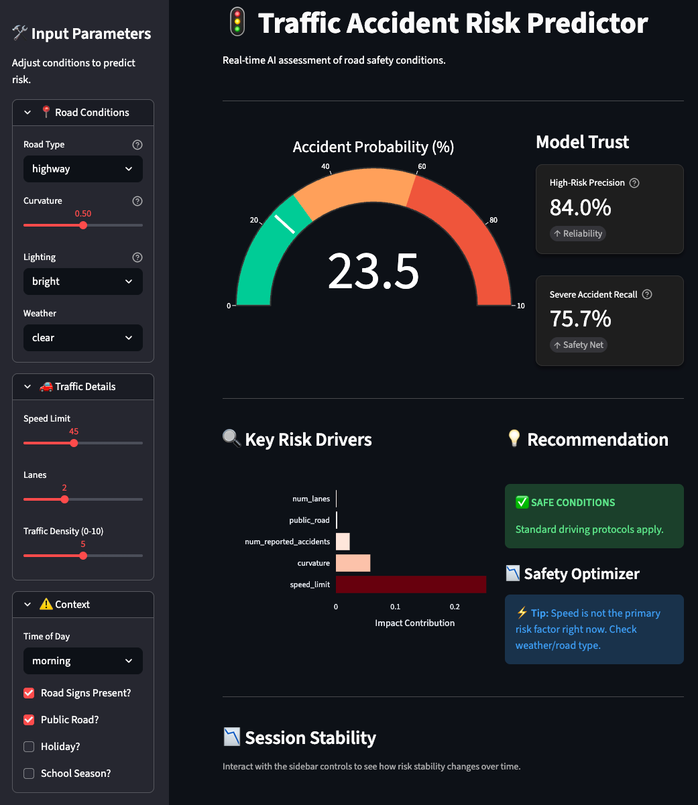

# Traffic Accident Risk Predictor

Streamlit dashboard with XGBoost model for estimating accident risk on simulated road scenarios. The model is trained on Kaggle Playground Series S5E10 – Predicting Road Accident Risk dataset.
Designed for quick exploration of road, weather, and traffic conditions with an interactive live prediction.

## Dataset
- Source: [Kaggle Playground Series S5E10 – Predicting Road Accident Risk](https://www.kaggle.com/competitions/playground-series-s5e10/data).
- Dataset note from kaggle: *The dataset for this competition (both train and test) was generated from a deep learning model trained on the [Simulated Roads Accident dataset](https://www.kaggle.com/datasets/ianktoo/simulated-roads-accident-data/) Feature distributions are close to, but not exactly the same, as the original.* 

## Quickstart
1. Create a virtual environment (Python 3.10+ recommended) and install deps:
   ```bash
   pip install -r requirements.txt
   ```
2. If you need to retrain, run:
   ```bash
   python xgboost_model.py
   ```
   This downloads the competition data, trains the tuned XGBoost regressor, computes precision/recall at a 0.6 threshold, and writes `accident_model_artifacts.joblib`.
3. Launch the dashboard:
   ```bash
   streamlit run streamlit_dashboard.py
   ```

## Dashboard Highlights
- Real-time probability gauge, key risk drivers, and recommendations based on the sidebar inputs.
- **Accident Probability Gauge**: Shows the live probability of an accident based on the current input combination.
- **Model Trust**: Shows the precision and recall scores of the model trained on the dataset with a 0.6 threshold for high risk. They're static snapshots; concept drift or new data can make them degrade over time.
- **Key Risk Drivers**: Highlights the top 5 features driving high accident risk based on the model's feature importance.
- **Recommendation**: Based on the current input combination, the dashboard provides a recommendation to the user to either reduce the risk or keep the current risk level.
   - 60% → red "HIGH RISK – delay or reroute"
   - 30-60% → amber "MODERATE RISK – drive cautiously"
   - <30% → green "SAFE – normal driving"
- **“Safety Optimizer**: tests lowering speed by 10 mph if current speed limit is >30 mph and compares the risk of the original speed limit vs. the new lower limit. 
   - If slowing down would cut the risk by more than 5 %-points it shows:
   “⚡ Tip: Reducing speed by 10 mph would lower risk by X %.”
   - If the improvement is ≤ 5 %-points it instead tells the user that speed isn’t the big issue right now and suggests looking at weather or road-type factors.
- **Session stability**: Shows a live risk prediction graph that updates as the sidebar controls is changed for the session to see how the model output changes with different input combinations. 

Screenshots:
- 

## Model Notes
- Model: `xgboost.XGBRegressor` with hyperparameters sourced from a prior search (see `xgboost_model.py`).
- Categorical features are one-hot encoded; boolean columns cast to ints; missing numeric values filled with column medians.
- Evaluation: precision/recall computed by binarizing predictions at 0.6 to approximate “high risk” classification.
- Saved artifacts: model, feature names, original categorical/bool column lists, and metrics.

## Project Structure
- `streamlit_dashboard.py` — interactive dashboard.
- `xgboost_model.py` — training script that produces `accident_model_artifacts.joblib`.
- `assets/` — dashboard screenshots for docs.
- `requirements.txt` — Python dependencies.
