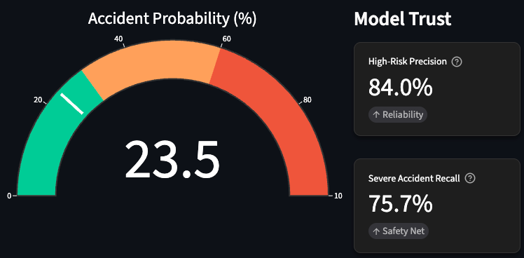
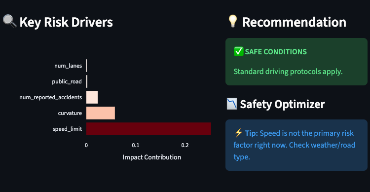

# Traffic Accident Risk Predictor

Streamlit dashboard and XGBoost model for estimating accident risk on simulated road scenarios. Designed for quick exploration of road, weather, and traffic conditions with an interactive UI.

## Dataset
- Source: [Kaggle Playground Series S5E10 – Predicting Road Accident Risk](https://www.kaggle.com/competitions/playground-series-s5e10/data).
- Data note: Train/test were generated by a deep learning model trained on the Simulated Roads Accident dataset; distributions are close to but not identical to the original. You can also pull the original dataset to compare or augment training.

## Quickstart
1. Create a virtual environment (Python 3.10+ recommended) and install deps:
   ```bash
   pip install -r requirements.txt
   ```
2. If you need to retrain, run:
   ```bash
   python xgboost_model.py
   ```
   This downloads the competition data, trains the tuned XGBoost regressor, computes precision/recall at a 0.6 threshold, and writes `accident_model_artifacts.joblib`.
3. Launch the dashboard:
   ```bash
   streamlit run streamlit_dashboard.py
   ```

## Dashboard Highlights
- Real-time probability gauge, key risk drivers, and recommendations based on your sidebar inputs.
- Theme toggle (light/dark) with custom styling for metrics and charts.
- Simple “Safety Optimizer” that tests lowering speed by 10 mph.

Screenshots:
- 
- 
- 

## Model Notes
- Model: `xgboost.XGBRegressor` with hyperparameters sourced from a prior search (see `xgboost_model.py`).
- Categorical features are one-hot encoded; boolean columns cast to ints; missing numeric values filled with column medians.
- Evaluation: precision/recall computed by binarizing predictions at 0.6 to approximate “high risk” classification.
- Saved artifacts: model, feature names, original categorical/bool column lists, and metrics.

## Project Structure
- `streamlit_dashboard.py` — interactive dashboard.
- `xgboost_model.py` — training script that produces `accident_model_artifacts.joblib`.
- `assets/` — dashboard screenshots for docs.
- `requirements.txt` — Python dependencies.
